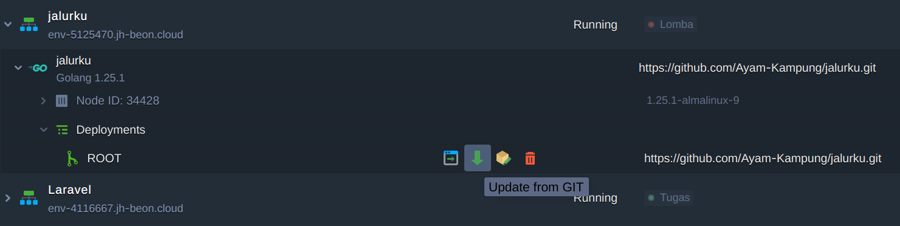

# jalurku
Website untuk JHIC

## Reproduksi
Untuk reproduksi lokal intinya:
- Menjalankan server melalui `fiber serve`, lalu
- Membangun Tailwind melalui `npm run dev:css`

### Jagoan Cloud
`jalurku` sudah dideploy melalui Jagoan Cloud, untuk mensinkronkan, ikuti langkah berikut.

`jalurku > Deployments > ROOT > Update from GIT` 



### Linux/MacOS/Mirip-UNIX
Sebelumnya terlebih dahulu klon repositori ini, dan pasang `go` sesuai dengan cara pemasagan paket pada setiap sistem operasi.

Praktik baik yaitu mengunduh dan merapikan keperluan dependensi. Maka dari itu lakukan langkah berikut.
```sh
$ go mod tidy
```

Sebelumnya tambahkan `$(go env GOPATH)/bin:$PATH` dalam `PATH` kamu, agar koleksi paket yang kita pasang melalui `go install` dapat dipanggil secara mudah.
```
~/.bashrc
---
PATH=$(go env GOPATH)/bin:$PATH
```

Pasang `fiber` pada sistemmu, berguna karena terdapat fitur *live-reload*, khusus untuk lokal saja.
```sh
$ go install github.com/gofiber/cli/fiber@latest
```

Terakhir jalankan servernya

```sh
$ fiber dev
```

### Windows/NT
Sebelumnya terlebih dahulu klon repositori ini, dan pasang `go`. Versi 1.17 keatas.
- https://go.dev/dl/ 

Praktik baik yaitu mengunduh dan merapikan keperluan dependensi. Maka dari itu lakukan berikut.
```sh
go mod tidy
```

Pasang `fiber` pada sistemmu, berguna karena terdapat fitur *live-reload*, khusus untuk lokal saja.
```sh
go install github.com/gofiber/cli/fiber@latest
```

Terakhir jalankan servernya

```sh
fiber dev
```

## Tailwind
Pasang Node.js pada sistemu terlebih dahulu
- https://nodejs.org/en/download

Terlebih dahulu pasang dependensinya
```
$ npm install
```

Untuk membangun cssnya, jalankan perintah berikut
```
$ npm run dev:css
```